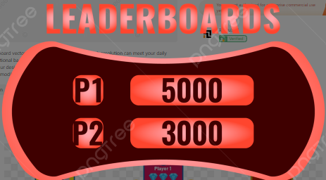

# Leaderboard-Project

  
   

  <h3><b>Leaderboard Project</b></h3>

# 📗 Table of Contents

- [📖 About the Project](#about-project)
  - [🛠 Built With](#built-with)
    - [Tech Stack](#tech-stack)
    - [Key Features](#key-features)
- [💻 Getting Started](#getting-started)
  - [Setup](#setup)
  - [Prerequisites](#prerequisites)
  - [Usage](#usage)
  - [Deployment](#triangular_flag_on_post-deployment)
- [👥 Authors](#authors)
- [🔭 Future Features](#future-features)
- [🤝 Contributing](#contributing)
- [⭐️ Show your support](#support)
- [🙏 Acknowledgements](#acknowledgements)

# 📖 "To-do List with webpack Project!" 

Leaderboard is a simple project built to consume the leaderboard API. A user can add their name and their score which then will be displayed on the list ot the existing scores. This app is also built with module files based on various functionalities, the stacks used to build the project are HTML, CSS and JS.

## 🛠 Built With 
### Tech Stack 

HTML

CSS

JS

  
HTML

  <ul>
    <li><a href="#">HTML</a></li>
  </ul>

 
Client

  <ul>
    <li><a href="https://developer.mozilla.org/ru/docs/Web/HTML">HTML</a></li>
    <li><a href="https://developer.mozilla.org/ru/docs/Web/CSS">CSS</a></li>
    <li><a href="https://developer.mozilla.org/ru/docs/Web/JS">JS</a></li>
  </ul>

### Key Features 
- **Navbar (menu-bar)**
- **localStorage functionality**
- **Add book functionality**
- **Remove book functionality**
- **Footer section**
- **contact information**

(<a href="#readme-top">back to top</a>)

## 🚀 Live Demo 
There is currently no live demo for this project

(<a href="#readme-top">back to top</a>)
 Fork this repo
> git clone git@github.com/Zuwairanajma/Leaderboard-Project.git

### Prerequisites

In order to run this project you need:

- GitHub account;
- Install Git on your OS.

### Install

Installations required to run this project:

- Webhint installation. Run the following command:
> npm install --save-dev hint@7.x

- Stylelint installation. Run the following command:
> npm install --save-dev stylelint@13.x stylelint-scss@3.x stylelint-config-standard@21.x stylelint-csstree-validator@1.x

- Eslint installation. Run the following command:
>  npm install --save-dev eslint@7.x eslint-config-airbnb-base@14.x eslint-plugin-import@2.x babel-eslint@10.x

- Webpack installation. Run the following command:
> npm install --save-dev style-loader css-loader html-webpack-plugin webpack-dev-server

### Usage

You can use this project by cloning it to your folder and changing index.html and styles.css files.

### Run tests

To run tests, run the following commands:

> npx hint .
> npx stylelint "**/*.{css,scss}"
> npx eslint .
> npm start

### Deployment

You can deploy this project using github pages or other hosting sites like netlify.com

(<a href="#readme-top">back to top</a>)

## 👥 Authors 

👤 **Author1**

👤 Zuwaira Sadiq
- GitHub: [@Zuwairanajma](https://github.com/Zuwairanajma)
- Twitter: [@SadiqJuwairiyya](https://twitter.com/SadiqJuwairiyya)
- LinkedIn: [Zuwaira Sadiq](https://www.linkedin.com/in/zuwaira-sadiq-566b891b0?)

(<a href="#readme-top">back to top</a>)

## 🔭 Future Features 

- [ ] **Functionalities**
- [ ] **Improved UI design**
- [ ] **Enhance Designs for all screen sizes and other media queries such as "print**
 

(<a href="#readme-top">back to top</a>)

## 🤝 Contributing 

Contributions, issues, and feature requests are welcome!

(<a href="#readme-top">back to top</a>)

## ⭐️ Show your support 

If you like this project, support and encourage me by staring it and leaving a comment. 

(<a href="#readme-top">back to top</a>)

## 🙏 Acknowledgments 

I would like to appreciate and acknowledge the esteem Microverse program for providing me with necessary template files and detailed instructions.

(<a href="#readme-top">back to top</a>)

## ❓ FAQ (OPTIONAL) 

**No FAQ for now**

(<a href="#readme-top">back to top</a>)

## 📝 License 

This project is [MIT](./LICENSE) licensed.

(<a href="#readme-top">back to top</a>)

